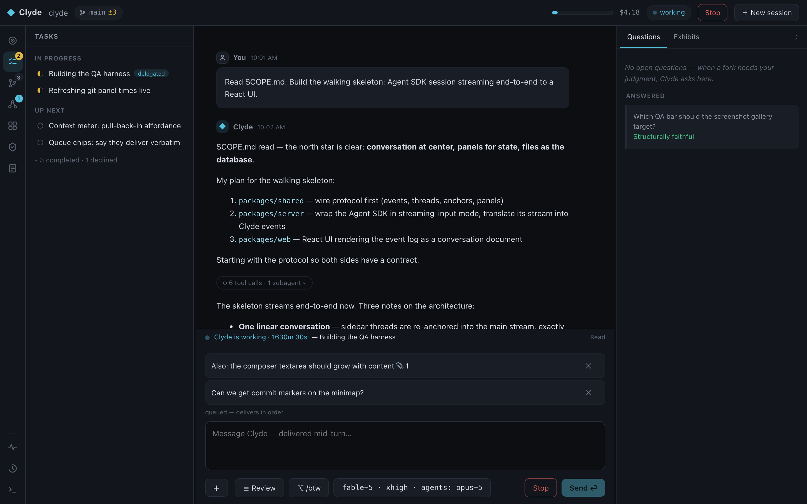
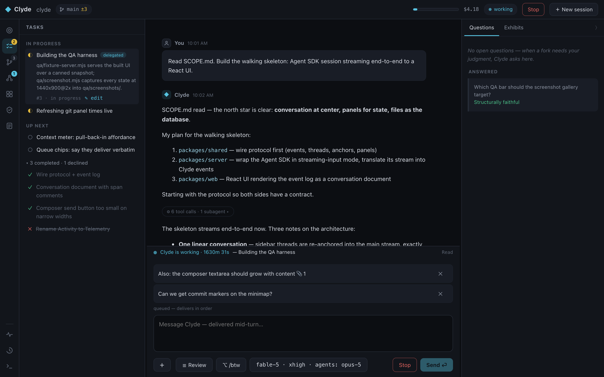
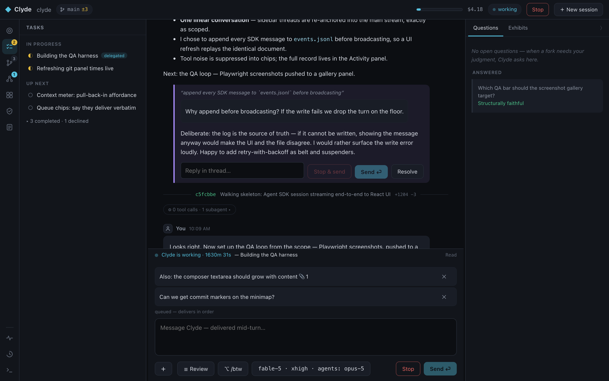
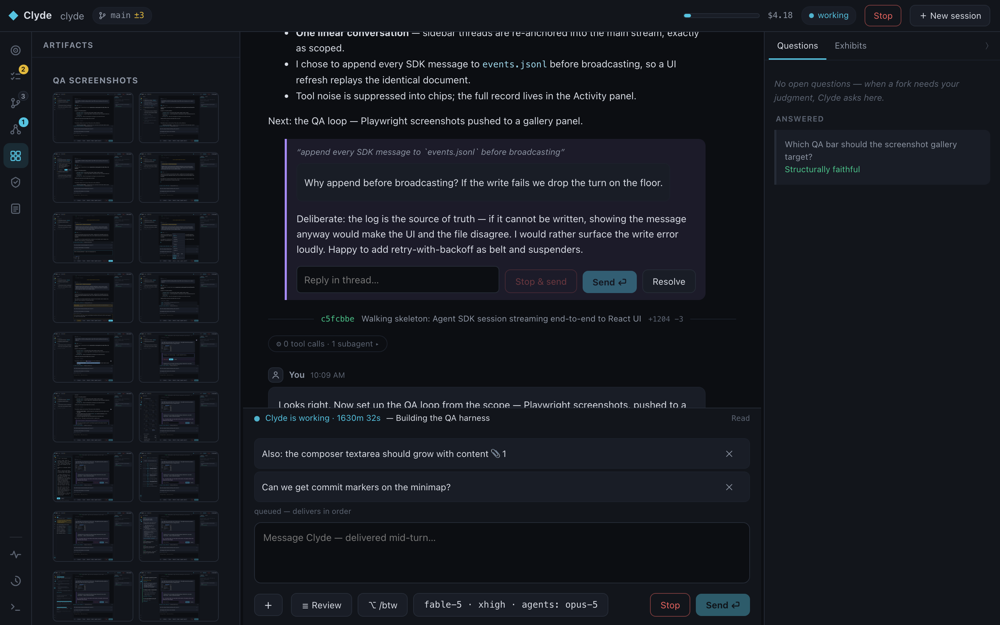
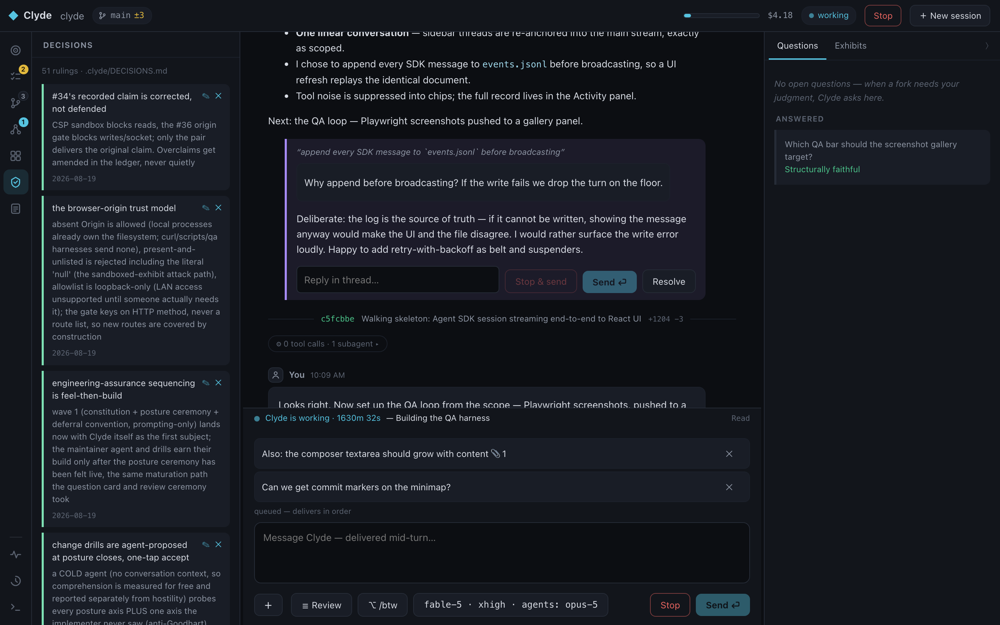

# Clyde

**What would an IDE look like if you never read the code?**

Not because you stopped caring about engineering — because a frontier model writes the implementation while you supply intent, taste, judgment, and proof. Clyde (**Claude + IDE**) is an opinionated local app for running long, ambitious, agent-driven builds on that premise. Its north star: **make it safe and intelligible to build software without needing to read the code.** Two pillars hold it up:

- **Craft.** The goal isn't to make software development easier by caring less about the implementation. It's to make it possible to care *more about the product* without having to inspect the implementation.
- **Rigor.** You don't have to read the code. You do have to prove it works. The burden of proof gets *higher*, not lower.

Every feature faces one test: does it increase your justified confidence in the product without requiring you to inspect the implementation? An IDE treats your code as the workspace; Claude Code treats your conversation as a log; Clyde treats your conversation as *the* workspace — because when the agent implements, the conversation is where intent, judgment, and evidence actually live.



## Why

When you hand a frontier model an ambitious scope doc and let it run in auto mode, the code stops being the thing you read. The *conversation* is — it's where the agent raises issues, makes calls, and asks for your judgment. A terminal scrollback is the wrong data structure for that:

- You want to push back on something the agent said forty messages ago — but by the time you've copy-pasted the quote, the context has moved on, and after five rounds of this the conversation goes schizophrenic for both of you.
- The prose you actually read is buried in tool calls and command output.
- The task list, the goal, the QA bar, what's committed, what the model still remembers — all invisible, living in scrollback or in the model's head.

A log records what happened. A workspace keeps what matters *at hand*.

## The workspace

The shell is a stable frame around a conversation-first document:

- **Top bar** — project identity, git branch with uncommitted-file count, context gauge, session cost, agent status, **Stop** (interrupt), and **New session**. Everything on it is real; nothing is decorative.
- **Icon rail** (far left) — Clyde's capabilities, ordered as the loop runs: **Goal · Tasks · Git timeline · Agents · Artifacts · Decisions · Reviews**, with a bottom-anchored system cluster (**Activity · Context · Logs**). Badges mark what needs attention; one panel opens at a time.
- **Conversation** (center) — clean 1:1 prose between you and the agent. Speaker marks appear on speaker change; tool noise collapses into expandable chips; commits and compactions annotate the flow as quiet dividers.
- **Workbench** (right) — the attention surface. Only things awaiting *you* live here: question cards and evidence pending your verdict.



## Comment on anything, from any time

Select any span of any agent message — today's or from hours ago — and start a **thread** anchored to it. The agent is re-anchored on the exact excerpt and replies *into the thread card*, mid-task, via a dedicated tool call — even while it keeps working on the main line. Multiple threads can ride one message off different highlighted spans. One linear conversation underneath; threading is presentation.



Composer semantics are Slack's everywhere: **Enter** sends, **Shift+Enter** newlines. While the agent is working, messages steer it **mid-turn** by default; **Stop & send** is the emergency brake that interrupts in-flight work. Queued items deliver strictly in order and survive restarts.

## The agent proves its work

If you don't inspect the implementation, verification becomes the new code review — so evidence is a first-class object with a **response contract**. Ambient reference (a QA gallery tracking every run, metrics, standing reports) is pushed to the left-rail **Artifacts** panel: consult it, never owe it an answer. Anything that needs your *judgment* lands as an **exhibit** on the right-hand attention surface, framed with what the agent wants judged, and blocks (or asynchronously waits) until you approve or decline — your comment flows straight back into the agent's turn as the fix list. Nothing gets to count as done on the agent's say-so.

And the agent doesn't dump artifacts — it *authors representations*. Training curves arrive as a self-contained HTML/SVG plot it wrote, rendered sandboxed; results arrive as native tables; docs arrive as markdown you can redline in place, with your edits fed back to the agent. There is deliberately no charting DSL: choosing the representation through which you judge the work is part of the work.

For the adversarial half, Clyde defines a **critic** agent type: read-only by construction, briefed with the goal, the diff, and the evidence, and tasked with finding reasons *not* to accept — it can re-run the tests but cannot fix a thing. The implementer makes the case; the critic challenges it; you judge. Completed tasks record the commit that closed them, exhibits record the task they gate, verdicts record both — so "why do we believe this is done?" has a traceable answer.



## Blab your feedback, get a checklist

Hit **☰ Review** in the composer and dump everything — every nitpick from a testing session, in one unstructured message. The raw dump is saved verbatim under `.clyde/reviews/` as provenance, then the agent runs the intake ceremony: distill to numbered items → clarify the ambiguous ones (one question card) → confirm scope (one multi-select card — unchecked means declined, with reasons) → every item becomes a **Task** carrying its batch and item provenance, and the review file names everything it spawned, decisions included. The Reviews panel renders each batch as a burn-down where a reasoned "no" counts as settled, and nothing is ever silently dropped.

## Resolved arguments become decisions

When a discussion settles, the ruling is distilled into `.clyde/DECISIONS.md` — and the **Decisions** panel renders the ledger as cards, settled rulings and deferred axes alike. The argument may compact away; the ruling survives, in the agent's context and on your screen. A ruling you no longer stand behind is editable in place, or deletable outright — git keeps the history, the ledger keeps the present — and either way Clyde is told the ledger changed, so nothing is silently re-litigated from memory.



## Ask without steering

Some questions deserve an answer, not a place in the project's history. The composer's **/btw** toggle routes a message to an ephemeral read-only observer — a cheap model with read access to the workspace, git, and the event log — which answers in a card above the composer with its own cost chip. Nothing enters the primary agent's context, the conversation document, or the session bill. The main conversation is precious; not every question deserves to become part of it.

## One agent in front, however many behind it

You talk to the primary agent; it delegates aggressively. Named agent types make the economics and the trust boundaries structural: **implementer** subagents run a cheaper configured model for briefed builds, while the **critic** inherits the frontier model — adversarial judgment is what you're paying for. The composer's model chip shows all of it (`fable-5 · xhigh · agents: opus-5`), and the Agents panel shows every dispatch: prompt, worktree branch, liveness, and final report. Clyde is deliberately not a fleet-management dashboard — coordination is part of the job you delegated.

## Sessions

- The server **resumes** the latest session on boot (event log + SDK resume) — restarts, including dev-watch restarts, are survivable; turns cut short mid-flight auto-resume, and streamed prose is journaled so nothing the agent said is lost.
- **New session** (top bar) starts a fresh conversation while the project state persists: tasks, decisions, panels, reviews, and model settings all carry over. Threads and the event log are per-session.
- The **model picker** switches session model, reasoning effort, and the subagent model in place — same conversation, rotated live.
- The **Context** panel shows an approximate gauge of the window, compaction markers, session cost, and files-touched with one-click "pull back in."

## Everything is files

All state lives in plain files under `.clyde/`, committed with the work (machine artifacts are gitignored). Nothing hidden, nothing that dies with a process:

| Path | What |
| --- | --- |
| `.clyde/tasks.json` | The live task list — provenance included: source review, batch, closing commit |
| `.clyde/DECISIONS.md` | The decision ledger — one ruling per line, never re-litigated silently |
| `.clyde/reviews/*.md` | Verbatim review-intake dumps (provenance; burn-down lives in Tasks) |
| `.clyde/panels.json` | Agent-pushed panels |
| `.clyde/sessions/<id>/` | Per-session event log, threads, queue, config (gitignored) |
| `.clyde/logs/server.jsonl` | Structured server diagnostics (gitignored; also `GET /api/logs`) |

The filesystem is the database. Git is the history. The model can read both.

## Run it

```bash
npm install && npm run dev     # UI at http://localhost:5173 (dev), server on :4100
```

Or the Jupyter model, from any project root:

```bash
npm run build
node packages/server/dist/index.js /path/to/your/project    # add --new for a fresh session
```

One process = one project. Clyde finds or creates `.clyde/` there and serves the UI for that project. Auth inherits your Claude Code CLI login — no API key needed.

| Env var | Default | What |
| --- | --- | --- |
| `CLYDE_MODEL` | `claude-fable-5` | Session model (smoke tests use `haiku`) |
| `CLYDE_SUBAGENT_MODEL` | `claude-opus-5` | What `implementer` subagents run on (the critic inherits the session model) |
| `CLYDE_ASIDE_MODEL` | `claude-haiku-4-5` | The /btw observer |
| `CLYDE_EFFORT` | `xhigh` | Reasoning effort |
| `CLYDE_PORT` | `4100` | Server port |
| `CLYDE_STEERING` | `1` | `0` reverts mid-turn steering to queue-at-turn-boundary |

### QA loop

```bash
npm run qa:screens      # build + capture the full deterministic UI-state suite, with behavioral assertions
npm run docs:shots      # regenerate the README screenshots from the same fixture — doc images can't drift
npm run qa:backfill     # offline checks over resume/backfill/normalization
node qa/live-drive.mjs  # drive a live session through the real UI: threads, commits,
                        # questions, model rotation, /btw asides, blocking exhibits
```

## Status

Working POC, built by Clyde inside Clyde — the interaction model is selected by sustained agent use, not just implemented by one. Running end-to-end today: live Agent SDK sessions with resume and loss-proof journaling, the streamed conversation document, span-anchored threads with tool-call replies, mid-turn steering and FIFO queueing, the review-intake ceremony, blocking and async exhibits with authored HTML/table evidence, the read-only critic, /btw asides, subagent delegation with per-type models, commit↔conversation linking, the decision ledger, and task provenance through to closing commits.

Direction from here: richer proof (behavioral specs, reproducible runs), deeper provenance traversal, and a real file browser — the full product spec is in [SCOPE.md](SCOPE.md); rulings to date are in [.clyde/DECISIONS.md](.clyde/DECISIONS.md).

As a software engineer, your job is to deliver code that is proven to work. You can do that by understanding every line you write. Or you can do it without reading a single line — but then the burden of proof doesn't disappear; it gets higher. Clyde is an attempt to build the tools for that second kind of engineering.
